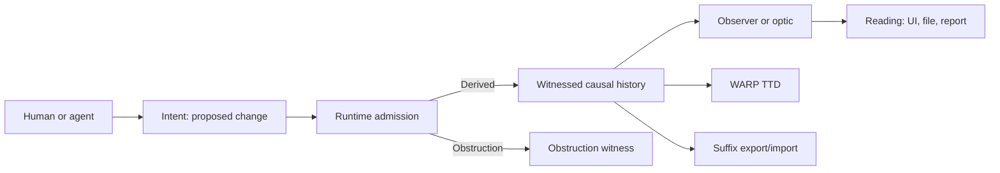
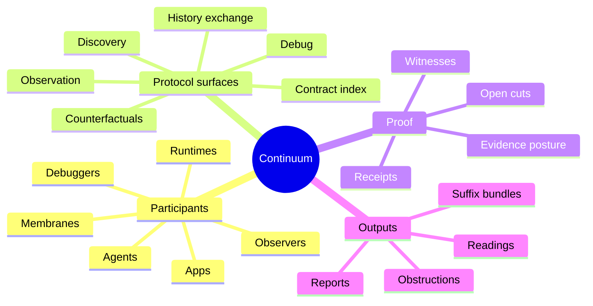
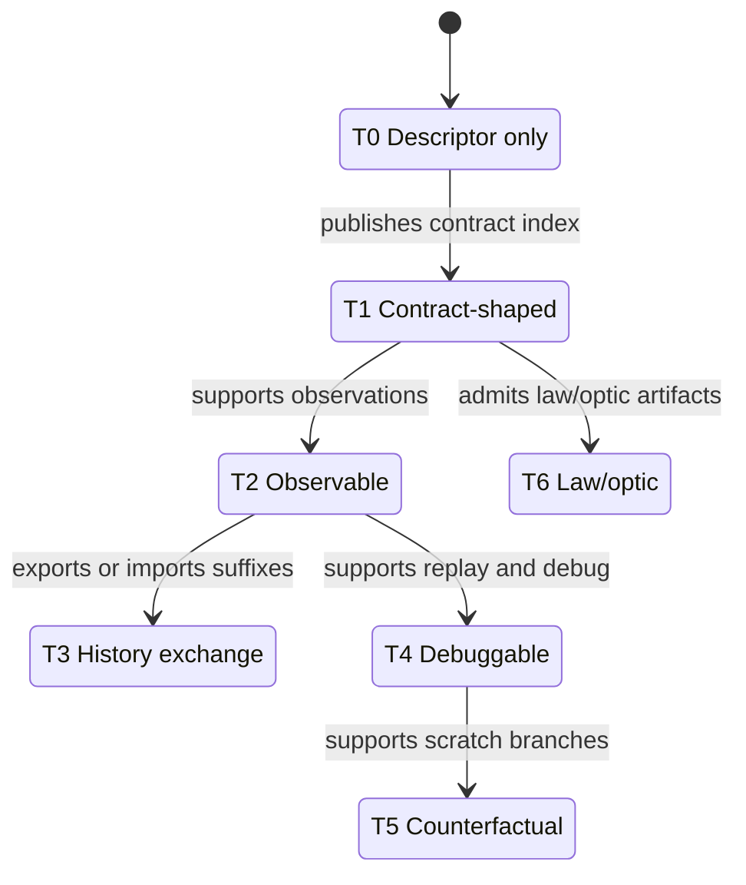
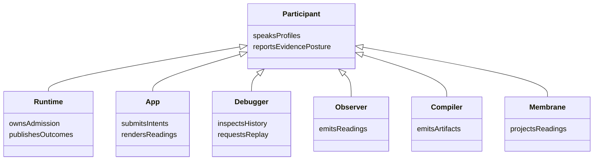
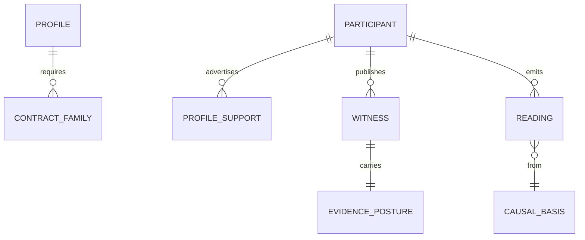
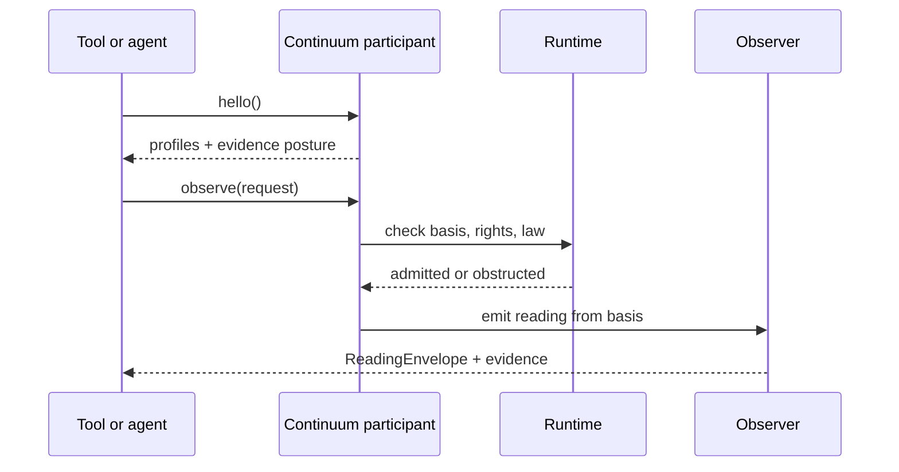

# Continuum

> A protocol suite for apps and tools that need to agree about what happened,
> why it happened, and what evidence proves it.

Continuum is the shared protocol layer for a growing causal-computing stack. If
you are new here, think of it as a way for independent runtimes, apps,
debuggers, agents, and developer tools to exchange **history with proof**
instead of copying one shared database or guessing from screenshots.

Continuum answers questions such as:

- What change was proposed?
- Was that change admitted, rejected, obstructed, or left plural?
- What causal history did it depend on?
- What witness or receipt proves the claim?
- Can another runtime import that history?
- Can a debugger inspect or replay it?
- Can an agent understand the result without scraping UI text?

## Current Work

Continuum is just getting started across the active stack. These rows are
orientation, not certification; compatibility claims become real only when
fixtures, runtime witnesses, or interop witnesses prove them.

| Project | Description | Role | Continuum Capability Tier / Posture |
| --- | --- | --- | --- |
| [Echo][echo] | Deterministic runtime over witnessed causal history. | Runtime participant and admission owner. | Target: T2/T3+ as native witnesses land. |
| [jedit][jedit] | Terminal-first editor shaped around Echo-backed editing. | Product-pressure app. | App participant over Echo; target: observable app. |
| [git-warp][git-warp] | Git-backed causal runtime direction. | Expected sibling runtime. | Target: T3 exchange; native evidence still open. |
| [Graft][graft] | Structural observer and review engine for code. | Observer participant. | T2-style structural readings with honest evidence. |
| [WARP TTD][warp-ttd] | Time-travel debugger and causal observer. | Debugger/operator participant. | Consumes T2/T4/T5 profiles from targets. |
| [WARP DRIVE][warp-drive] | POSIX-shaped membrane over readings and intents. | Filesystem membrane participant. | Profile/app over observation and intent surfaces. |
| [Wesley][wesley] | Semantic contract compiler and witness tooling. | Compiler participant. | Compiles families; does not own runtime truth. |
| Continuum | Shared protocol doctrine, schemas, registry, and invariants. | Protocol source. | Defines profiles and tiers; not a runtime. |

## The Problem Continuum Solves

Most software tools ask for "current state." That works until several systems
need to agree about how that state came to exist.

For example:

1. A user edits a document.
2. An agent proposes a change.
3. A runtime decides whether that change is allowed.
4. A debugger asks what happened.
5. A filesystem-like tool wants to show the result as files.
6. Another runtime wants to import part of the history.

If every tool invents its own story, the ecosystem drifts. If every tool is
forced to share one database, the ecosystem stops being an ecosystem.

Continuum defines the boundary facts that can cross implementation lines:

- proposed work;
- admission decisions;
- causal coordinates;
- witnesses and receipts;
- observations and readings;
- suffix export/import;
- obstruction reasons;
- capability and redaction posture.

Everything inside a runtime remains runtime-local.

## A Tiny Example

A Continuum-shaped editor does not directly mutate a hidden global state. It
submits an intent to a runtime. The runtime admits or obstructs that intent,
records the result in witnessed causal history, and then tools observe readings
from that history.



In plain language:

- **Intent:** "I want to do this."
- **Admission:** "The runtime decided whether that can happen."
- **Witness:** "Here is evidence for the decision."
- **Reading:** "Here is one lawful view of the resulting history."

## The Model Shift

Continuum starts from this sentence:

**The graph is a coordinate chart over witnessed causal history.**

That can sound abstract, so here is the practical meaning:

- There is no one magic graph that every tool must read.
- The durable thing is the history of admitted changes and their evidence.
- A graph, file tree, debugger frame, editor buffer, or UI screen is a reading
  over that history.
- Different tools may produce different readings from the same causal basis.
- Those readings must preserve what was proven, redacted, obstructed, or still
  unresolved.

The short version:

```text
History is the territory.
The graph is a coordinate chart.
State is a policy-relative materialized view.
Files are readings.
Writes are intents.
Admission is witnessed.
```

## How The Pieces Fit



## Core Terms

| Term | Plain meaning | Why it matters |
| --- | --- | --- |
| Participant | Anything that speaks at least one Continuum profile. | Apps, runtimes, tools, and fixtures can all join honestly. |
| Runtime | A participant that owns admission for at least one causal lane. | Runtimehood means authority over admission, not just observation. |
| Profile | A named behavior contract, such as observation or debug. | A participant can support some profiles without supporting all of them. |
| Contract family | Shared schema nouns authored as GraphQL SDL. | Families define shape; profiles define behavior. |
| Intent | Proposed work. | Writes and actions start as proposals, not direct mutation. |
| Admission | Runtime decision against a bounded basis and law. | This is where proposed work becomes causal history or gets blocked. |
| Witness | Evidence for a claim. | Tools should not trust prose when a witness is required. |
| Receipt | Transport/operator wrapper around evidence. | Receipts help tools route, inspect, retain, and explain claims. |
| Reading | A lawful view over causal history. | UI, files, graphs, reports, and debugger frames are readings. |
| Observer | A lawful read process with basis, aperture, budget, and law. | Observers explain where readings came from. |
| Lane | A causal track where history accumulates. | Lanes let work branch, converge, or remain plural. |
| Frontier | The known boundary of a lane or set of lanes. | Frontiers make "from which point?" explicit. |
| Suffix | A package of causal history for export/import. | Continuum exchanges suffixes, not snapshots. |
| Evidence posture | Native, translated, fixture, redacted, obstructed, etc. | Prevents fake compatibility claims. |
| Obstruction | Machine-readable refusal or blockage. | Agents and humans can learn what boundary was hit. |
| Counterfactual | Scratch branch used to ask "what if?" | Counterfactuals are not canonical until promoted. |
| Warpspace | Local project constellation and stack manifest. | Lets tools know which families, targets, and roots are in play. |

## Capability Tiers

Continuum compatibility grows in visible tiers. A participant can join early
without pretending to support everything.



- **T0 - Descriptor only:** the participant can say what it is and what it does
  not support.
- **T1 - Contract-shaped:** the participant publishes or consumes contract
  families and schema digests.
- **T2 - Observable:** the participant can answer observation requests with
  reading envelopes.
- **T3 - History exchange:** the participant can export or import witnessed
  suffixes.
- **T4 - Debuggable:** the participant supports replay/seek/step semantics for
  advertised debug operations.
- **T5 - Counterfactual:** the participant supports scratch branches and
  divergence reports.
- **T6 - Law/optic:** the participant can admit, obstruct, revoke, and witness
  law or optic artifacts.

## Participant Types



A runtime is not "anything that can speak Continuum." A runtime owns admission
for at least one causal lane or history domain. Participants that only observe,
adapt, debug, mount, compile, or test are still useful participants, but they
are not runtimes.

## Profile And Evidence Model



Profiles describe behavior. Contract families describe shared nouns.

Example: `continuum.observation.v1` is a profile. It may require the
runtime-boundary nouns `ObserverPlan`, `ObservationRequest`, and
`ReadingEnvelope`, but compiling those nouns does not prove that a participant
can preserve rights, residuals, obstruction behavior, and evidence posture.

## Basic Interaction



This is why Continuum is agent-friendly: the tool receives structured facts,
not just rendered text.

## Profiles In Plain Language

- `continuum.participant.hello.v1`: describe identity, supported profiles,
  contract families, connection hints, auth posture, and evidence posture.
- `continuum.contract.index.v1`: publish authored/consumed families, generated
  artifacts, schema digests, witnesses, and open cuts.
- `continuum.observation.v1`: request lawful readings and return
  evidence-bearing `ReadingEnvelope` results or obstructions.
- `continuum.history.exchange.v1`: export/import witnessed suffixes and report
  settlement/import outcomes.
- `continuum.debug.v1`: let WARP TTD or another debugger inspect causal history
  without app-specific knowledge.
- `continuum.counterfactual.v1`: create scratch branches, run alternate
  histories, compare outcomes, and request explicit promotion.
- `continuum.law.optic.v1`: publish compiled law/optic artifacts and request
  runtime admission without ambient authority.
- `continuum.warpspace.v1`: describe local app constellations, runtime targets,
  generated roots, and stack tuple locks.
- `continuum.agent.v1`: give agents structured discovery, inspection, proposal,
  rehearsal, and obstruction surfaces.
- `continuum.warp-drive.v1`: mount readings as files and submit writes as
  intents without making POSIX core ontology.

Historical `runtime.hello` wording is superseded by
`continuum.participant.hello.v1` for normative Continuum discovery.

## WARP TTD And WARP DRIVE

WARP TTD compatibility is not automatic. A target can be:

- **inspectable:** it supports observation and reading envelopes;
- **debuggable:** it also supports replay, seek, and step over retained or
  reconstructible evidence;
- **counterfactual-debuggable:** it also supports scratch branches, alternate
  runs, divergence reports, and explicit promotion requests.

Debug access is never authority-free by default. Private history, sensitive
lanes, payload bodies, suffix export, branch creation, law admission, and
promotion are capability-gated operations.

WARP DRIVE sits in a different layer:

```text
read file     -> ObservationRequest
file bytes    -> ReadingPayload
write file    -> IntentEnvelope
save result   -> TickResult | Obstruction
path          -> observer-relative coordinate
mount         -> profile descriptor + capability posture
stat metadata -> evidence posture + basis/frontier/digest
```

WARP DRIVE mounts readings, not substrate truth.

## What Continuum Is Not

Continuum is not:

- a runtime;
- a graph database;
- a storage engine;
- a scheduler;
- a debugger UI;
- a filesystem;
- a state-sync protocol;
- a CRDT framework;
- a global law registry;
- a universal app ontology;
- a cloud daemon that must be online;
- a place for tools to fake compatibility.

Echo, `git-warp`, and future runtimes own runtime truth. Wesley compiles
contracts. WARP TTD debugs. WARP DRIVE mounts readings. Graft observes
structure. Apps create product experiences.

Continuum owns the shared boundary language and proof posture that lets those
systems cooperate.

## What This Repo Owns

Continuum owns:

- shared GraphQL contract families in [schemas](schemas/README.md);
- protocol doctrine in
  [Continuum Compendium V1](docs/design/0031-continuum-compendium-v1/README.md);
- contract-family ownership and witness posture in
  [docs/contract-family-registry.md](docs/contract-family-registry.md);
- cross-repo invariants in
  [docs/invariants/CONTINUUM.md](docs/invariants/CONTINUUM.md);
- WARPspace bootstrap direction in [apps/warp](apps/warp/README.md);
- Continuum-owned Wesley module surfaces under [wesley](wesley/README.md);
- design packets and METHOD-shaped coordination discipline.

Continuum does not own:

- Echo-local engine internals;
- `git-warp`-local engine internals;
- WARP TTD product/session internals;
- WARP DRIVE filesystem product semantics beyond shared profile boundaries;
- Graft-local structural reading payloads before promotion;
- generic Wesley base-platform implementation truth;
- app-local domain schemas;
- one canonical materialized graph.

## Getting Started

Read in this order:

1. [Continuum Compendium V1](docs/design/0031-continuum-compendium-v1/README.md)
2. [docs/GETTING_STARTED.md](docs/GETTING_STARTED.md)
3. [docs/contract-family-registry.md](docs/contract-family-registry.md)
4. [docs/invariants/CONTINUUM.md](docs/invariants/CONTINUUM.md)
5. [schemas/README.md](schemas/README.md)

Try the WARPspace bootstrap proof:

```bash
node apps/warp/bin/warp.mjs init my-app --profile demo
```

Run the currently independent WARPspace tests:

```bash
node --test apps/warp/test/*.test.mjs
```

Deeper orientation:

- [docs/OVERVIEW.md](docs/OVERVIEW.md)
- [docs/VISION.md](docs/VISION.md)
- [docs/BEARING.md](docs/BEARING.md)
- [METHOD.md](METHOD.md)
- [APP_GLOSSARY.md](APP_GLOSSARY.md)

## Current Implementation Direction

The next honest proof is small:

1. Define `continuum.participant.hello.v1`.
2. Add a descriptor-only participant fixture.
3. Add structured evidence posture.
4. Generate a witness through Wesley.
5. Prove WARP TTD can discover a target without app-specific knowledge.
6. Teach `warp doctor` to report profile/evidence status honestly.

No counterfactuals yet. No global law registry yet. No identity-system decision
yet. No federation surface yet.

## Rule To Remember

There is no canonical materialized graph.

There is witnessed causal history, and graph-like structure is an
observer-relative reading over that history.

## License

Continuum (c) 2026 by James Ross.

Licensed under the [Apache License 2.0](./LICENSE).

[echo]: https://github.com/flyingrobots/echo
[graft]: https://github.com/flyingrobots/graft
[git-warp]: https://github.com/git-stunts/git-warp
[jedit]: https://github.com/flyingrobots/jedit
[warp-drive]: https://github.com/flyingrobots/warp-drive
[warp-ttd]: https://github.com/flyingrobots/warp-ttd
[wesley]: https://github.com/flyingrobots/wesley
