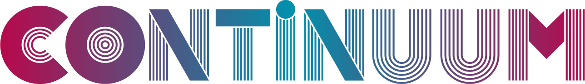

<div align="center">


<p><i>Most tools share state. Continuum shares history with proof.</i></p>
</div>

---

# Continuum

Most tools share **state**. Continuum shares **history with proof**.

Continuum is the shared protocol layer for a causal-computing stack. It gives independent runtimes, apps, debuggers, agents, and developer tools a common way to exchange witnessed history instead of copying one shared database or scraping screenshots. 

→ [Full reference](README_FULL.md)

## Why it exists

Most software answers one question: "What is the current state?" That works until several systems need to agree about how that state came to exist, what rules applied along the way, and what evidence proves the result. 

Continuum gives runtimes, apps, debuggers, agents, and developer tools a shared way to talk about changes without forcing them into one database or one UI story. Everything inside a runtime stays runtime-local. Continuum standardizes the shared boundary. 

## The basic idea

A Continuum-shaped system does not treat writes as direct mutation. A tool submits an **intent**, a runtime decides whether to admit it, and the result becomes part of witnessed causal history that other tools can observe as lawful **readings**. 

In plain language:

- **Intent**: "I want to do this."
- **Admission**: "The runtime decided whether that can happen."
- **Witness**: "Here is evidence for the decision."
- **Reading**: "Here is one lawful view of the resulting history." 

## The model shift

Continuum starts from this claim:

> **The graph is a coordinate chart over witnessed causal history.** 

That means the durable thing is not one canonical graph or one canonical state. The durable thing is admitted history plus evidence, while graphs, file trees, debugger frames, editor buffers, and UIs are all readings over that history. 

The short version:

```text
History is the territory.
The graph is a coordinate chart.
State is a policy-relative materialized view.
Files are readings.
Writes are intents.
Admission is witnessed.
```


## What Continuum is not

Continuum is not a runtime, graph database, storage engine, scheduler, filesystem, state-sync protocol, CRDT framework, or cloud daemon. It also is not a place for tools to fake compatibility. 

Echo and `git-warp` own runtime truth. Wesley compiles contracts. WARP TTD debugs. WARP DRIVE mounts readings. Graft observes structure. Continuum owns the shared boundary language and proof posture that lets those systems cooperate. 

## Getting started

For a map of all documentation by reader goal, start at the [docs index](docs/index.md).

If the goal is to understand the model, start with [docs/OVERVIEW.md](docs/OVERVIEW.md) and then read [README_FULL.md](README_FULL.md). 

If the goal is to run something first, try:

```bash
node apps/warp/bin/warp.mjs init my-app --profile demo
node --test apps/warp/test/*.test.mjs
```


Then continue with [docs/GETTING_STARTED.md](docs/GETTING_STARTED.md), [docs/contract-family-registry.md](docs/contract-family-registry.md), [docs/invariants/CONTINUUM.md](docs/invariants/CONTINUUM.md), and [schemas/README.md](schemas/README.md). 
