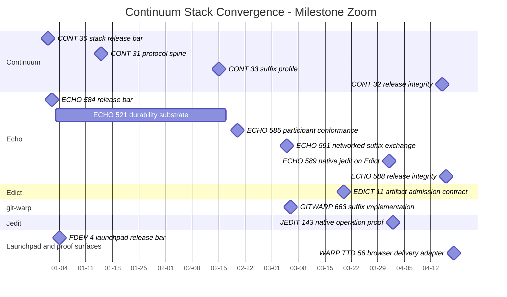
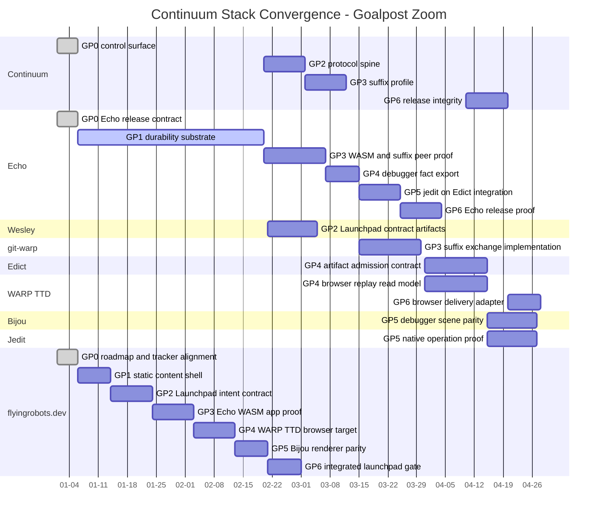

# Continuum Stack Project Slice Plan

**Cycle:** 0037-continuum-stack-project-slice-plan
**Legend:** SOURCE
**Type:** project slice ledger
**Sponsored human:** A stack maintainer wants the release plan written
goalpost-by-goalpost, grouped by repository, without losing the GitHub issue
coordinates that define the work.
**Sponsored agent:** A planning or execution agent needs a compact checklist of
the cross-repository slices that lead from the current Echo durability work to
Continuum stack convergence.

Refines:

- [0036 - Continuum Stack Release Roadmap](../0036-continuum-stack-release-roadmap/README.md)
- [0035 - Continuum Stack Convergence](../0035-continuum-stack-convergence/README.md)

## Hill

Record a versioned projection of the slice-by-slice plan from the Continuum
Stack Convergence Project in the repository that owns coordination doctrine.

GitHub Project #15 and the GitHub issue graph are the roadmap authority. This
packet is a snapshot and orientation artifact. It is not the live task tracker.
Current issue status, dependencies, pull request links, assignees, review state,
proof state, and blockers belong in GitHub. If this packet disagrees with
GitHub live state, GitHub wins.

- Project: [Continuum Stack Convergence](https://github.com/users/flyingrobots/projects/15)
- Release bar: [continuum#30](https://github.com/flyingrobots/continuum/issues/30)
- Issue graph: the release bar, gate issues, capability epics, and PR-sized
  slices linked from Project #15

The lists below reflect Project #15 after Echo PR #599 merged on 2026-06-21.

## Legend

- `[x]` means the Project item was `Done` when this snapshot was written.
- `[ ]` means the Project item was not `Done` when this snapshot was written.
- `*_PR_*` entries are Project evidence rows. They are not new work slices.
- GitHub issue rows are the work authority. Pull requests and proof packets are
  evidence that issue contracts were satisfied.

## Gantt Zoom Layers

The Mermaid Gantt charts below are sequencing maps, not schedules. Mermaid
requires dates, so the dates are ordinal placeholders. The first placeholder
day means "first sequencing slot," not a calendar commitment.

### Milestone Zoom

This view shows the release-bar and gate milestones grouped by owning project.



### Goalpost Zoom

This view shows the cross-repository goalposts grouped by project. Goalpost
durations are relative work bands, not estimates.



### Slice Zoom

This view shows issue-owned slices grouped by project and local goalpost band.
It omits Project evidence PR rows because those prove completed work rather
than define new work.

```mermaid
gantt
    title Continuum Stack Convergence - Slice Zoom
    dateFormat  YYYY-MM-DD
    axisFormat  %m-%d
    todayMarker off

    section Continuum GP0
    CONT 30 release bar                       :cont_30_s, 2026-01-01, 2d

    section Echo GP0
    ECHO 584 release bar                      :echo_584_s, 2026-01-01, 2d

    section flyingrobots.dev GP0
    FDEV 4 release bar                        :fdev_4_s, 2026-01-01, 2d
    FDEV 11 tracker alignment                 :done, fdev_11_s, after fdev_4_s, 1d
    FDEV 12 roadmap packet                    :done, fdev_12_s, after fdev_11_s, 1d

    section Echo GP1 durability
    ECHO 521 WAL WSC relationship             :echo_521_s, 2026-01-05, 1d
    ECHO 554 WAL store adapter                :done, echo_554_s, after echo_521_s, 2d
    ECHO 555 filesystem ACK path              :done, echo_555_s, after echo_554_s, 2d
    ECHO 556 failure atomicity                :done, echo_556_s, after echo_555_s, 2d
    ECHO 557 recovery CLI contract            :done, echo_557_s, after echo_556_s, 2d
    ECHO 558 durable runtime WAL gate         :active, echo_558_s, after echo_557_s, 2d
    ECHO 559 WAL projection fact types        :echo_559_s, after echo_558_s, 2d
    ECHO 560 projection from recovery         :echo_560_s, after echo_559_s, 2d
    ECHO 561 graph materialization            :echo_561_s, after echo_560_s, 2d
    ECHO 562 projection authority negatives   :echo_562_s, after echo_561_s, 2d
    ECHO 563 WSC export profiles              :echo_563_s, after echo_562_s, 2d
    ECHO 564 ref-only WSC fixture             :echo_564_s, after echo_563_s, 2d
    ECHO 565 self-contained WSC fixture       :echo_565_s, after echo_564_s, 2d
    ECHO 566 CAS-addressed WSC fixture        :echo_566_s, after echo_565_s, 2d
    ECHO 567 WSC store durability adapter     :echo_567_s, after echo_566_s, 2d
    ECHO 568 WSC export import CLI            :echo_568_s, after echo_567_s, 2d
    ECHO 569 retained ref crosswalk           :echo_569_s, after echo_568_s, 2d
    ECHO 570 durable retained blob tier       :echo_570_s, after echo_569_s, 2d
    ECHO 571 WAL after retention ordering     :echo_571_s, after echo_570_s, 2d
    ECHO 572 retained evidence WSC export     :echo_572_s, after echo_571_s, 2d
    ECHO 573 missing retention semantics      :echo_573_s, after echo_572_s, 2d
    ECHO 574 recovery plan object             :echo_574_s, after echo_573_s, 2d
    ECHO 575 projection rebuild recovery      :echo_575_s, after echo_574_s, 2d
    ECHO 576 materialization outbox recovery  :echo_576_s, after echo_575_s, 2d
    ECHO 577 process kill crashpoint runner   :echo_577_s, after echo_576_s, 2d
    ECHO 578 DIND durability convergence      :echo_578_s, after echo_577_s, 2d
    ECHO 579 durability release test slice    :echo_579_s, after echo_578_s, 2d
    ECHO 580 documentation truth gate         :echo_580_s, after echo_579_s, 2d
    ECHO 581 umbrella closure audit           :echo_581_s, after echo_580_s, 2d

    section flyingrobots.dev GP1
    FDEV 7 static content shell               :fdev_7_s, 2026-01-08, 2d
    FDEV 13 static content manifest           :fdev_13_s, after fdev_7_s, 2d
    FDEV 17 shell routes as intents           :fdev_17_s, after fdev_13_s, 2d

    section Continuum GP2
    CONT 31 protocol spine                    :cont_31_s, 2026-02-20, 3d

    section Wesley GP2
    WESLEY 616 GraphQL contract fixture       :wesley_616_s, 2026-02-21, 2d
    WESLEY 615 contract host artifacts        :wesley_615_s, after wesley_616_s, 2d
    WESLEY 617 contract evidence package      :wesley_617_s, after wesley_615_s, 2d

    section flyingrobots.dev GP2
    FDEV 6 intent contract artifacts          :fdev_6_s, 2026-02-21, 3d

    section Continuum GP3
    CONT 33 suffix exchange profile           :cont_33_s, 2026-03-10, 3d

    section Echo GP3
    ECHO 500 WASM runtime integration         :echo_500_s, 2026-03-10, 3d
    ECHO 595 browser host capability          :echo_595_s, after echo_500_s, 2d
    ECHO 594 witnessed receipts readings      :echo_594_s, after echo_595_s, 2d

    section git-warp GP3
    GITWARP 663 suffix implementation         :gitwarp_663_s, 2026-03-14, 5d

    section flyingrobots.dev GP3
    FDEV 9 Echo WASM app proof                :fdev_9_s, 2026-03-10, 3d
    FDEV 14 client adapter intents            :fdev_14_s, after fdev_9_s, 2d

    section Edict GP4
    EDICT 11 artifact admission contract      :edict_11_s, 2026-03-25, 5d

    section Echo GP4
    ECHO 596 debugger safe session facts      :echo_596_s, 2026-03-25, 2d

    section WARP TTD GP4
    WARPTTD 108 hello target descriptor       :warpttd_108_s, 2026-03-25, 2d
    WARPTTD 107 tick history read model       :warpttd_107_s, after warpttd_108_s, 2d
    WARPTTD 106 rewind control contract       :warpttd_106_s, after warpttd_107_s, 2d

    section flyingrobots.dev GP4
    FDEV 5 browser replay read model          :fdev_5_s, 2026-03-25, 4d

    section Bijou GP5
    BIJOU 302 GraphQL-authored blocks         :bijou_302_s, 2026-04-10, 2d
    BIJOU 442 browser renderer seam           :bijou_442_s, after bijou_302_s, 2d
    BIJOU 441 debugger scene IR fixture       :bijou_441_s, after bijou_442_s, 2d
    BIJOU 443 terminal browser parity         :bijou_443_s, after bijou_441_s, 2d

    section Jedit GP5
    JEDIT 143 native operation proof          :jedit_143_s, 2026-04-10, 5d

    section flyingrobots.dev GP5
    FDEV 10 renderer parity gate              :fdev_10_s, 2026-04-10, 5d

    section Continuum GP6
    CONT 32 release integrity                 :cont_32_s, 2026-04-25, 5d

    section WARP TTD GP6
    WARPTTD 56 browser delivery adapter       :warpttd_56_s, 2026-04-25, 3d

    section flyingrobots.dev GP6
    FDEV 8 integrated release gate            :fdev_8_s, 2026-04-25, 3d
    FDEV 16 tick history surface              :fdev_16_s, after fdev_8_s, 2d
    FDEV 15 preview and privacy gate          :fdev_15_s, after fdev_16_s, 2d
```



## Target 1.0 / Goalpost 0: Control Surface And Release Bar

Purpose: establish the release bar, Project, ownership map, and GitHub-native
planning boundary.

### Continuum (GP0)

- [ ] CONT_30: Continuum Stack Convergence Release Bar
      ([#30](https://github.com/flyingrobots/continuum/issues/30)).
- [x] CONT_PR_36: docs: record Continuum stack release roadmap
      ([PR #36](https://github.com/flyingrobots/continuum/pull/36)).

### Echo (GP0)

- [ ] ECHO_584: Echo 1.0 Release Bar
      ([#584](https://github.com/flyingrobots/echo/issues/584)).
- [x] ECHO_PR_582: docs: define the Echo 1.0 release contract and move live
      planning to GitHub
      ([PR #582](https://github.com/flyingrobots/echo/pull/582)).

### flyingrobots.dev (GP0)

- [ ] FDEV_4: Launchpad Browser Replay Release Bar
      ([#4](https://github.com/flyingrobots-labs/flyingrobots.dev/issues/4)).
- [x] FDEV_11: [LP-GP0] Roadmap, tracker, and boundary alignment
      ([#11](https://github.com/flyingrobots-labs/flyingrobots.dev/issues/11)).
- [x] FDEV_12: [LP-GP0-S1] Record Launchpad browser-replay roadmap in repo
      ([#12](https://github.com/flyingrobots-labs/flyingrobots.dev/issues/12)).
- [x] FDEV_PR_18: Refresh Continuum site and add launchpad roadmap
      ([PR #18](https://github.com/flyingrobots-labs/flyingrobots.dev/pull/18)).

## Target 1.0 / Goalpost 1: Durable Causal History

Purpose: make Echo's accepted causal history durable enough to support later
Continuum participation, suffix exchange, retained evidence, and release proof.

### Echo (GP1)

- [ ] ECHO_521: WAL/WSC Storage Relationship
      ([#521](https://github.com/flyingrobots/echo/issues/521)).
- [x] ECHO_554: [GP1-S1] Runtime WAL Store Adapter Boundary
      ([#554](https://github.com/flyingrobots/echo/issues/554)).
- [x] ECHO_555: [GP1-S2] Filesystem Runtime WAL ACK Path
      ([#555](https://github.com/flyingrobots/echo/issues/555)).
- [x] ECHO_556: [GP1-S3] Filesystem Runtime WAL Failure Atomicity
      ([#556](https://github.com/flyingrobots/echo/issues/556)).
- [x] ECHO_557: [GP1-S4] Runtime WAL Recovery CLI Contract
      ([#557](https://github.com/flyingrobots/echo/issues/557)).
- [ ] ECHO_558: [GP1-S5] Durable Runtime WAL Gate
      ([#558](https://github.com/flyingrobots/echo/issues/558)).
- [ ] ECHO_559: [GP2-S1] WAL Projection Fact Types
      ([#559](https://github.com/flyingrobots/echo/issues/559)).
- [ ] ECHO_560: [GP2-S2] Projection From WAL Recovery
      ([#560](https://github.com/flyingrobots/echo/issues/560)).
- [ ] ECHO_561: [GP2-S3] WARP Graph Materialization Of WAL Evidence
      ([#561](https://github.com/flyingrobots/echo/issues/561)).
- [ ] ECHO_562: [GP2-S4] Projection Authority Negative Cases
      ([#562](https://github.com/flyingrobots/echo/issues/562)).
- [ ] ECHO_563: [GP3-S1] WSC Causal-History Export Profiles
      ([#563](https://github.com/flyingrobots/echo/issues/563)).
- [ ] ECHO_564: [GP3-S2] Ref-Only WSC Export Fixture
      ([#564](https://github.com/flyingrobots/echo/issues/564)).
- [ ] ECHO_565: [GP3-S3] Self-Contained WSC Export Fixture
      ([#565](https://github.com/flyingrobots/echo/issues/565)).
- [ ] ECHO_566: [GP3-S4] CAS-Addressed WSC Export Fixture
      ([#566](https://github.com/flyingrobots/echo/issues/566)).
- [ ] ECHO_567: [GP3-S5] WSC Store Durability Adapter
      ([#567](https://github.com/flyingrobots/echo/issues/567)).
- [ ] ECHO_568: [GP3-S6] WSC Export/Import CLI
      ([#568](https://github.com/flyingrobots/echo/issues/568)).
- [ ] ECHO_569: [GP4-S1] Retained Ref Crosswalk
      ([#569](https://github.com/flyingrobots/echo/issues/569)).
- [ ] ECHO_570: [GP4-S2] Durable Retained Blob Tier
      ([#570](https://github.com/flyingrobots/echo/issues/570)).
- [ ] ECHO_571: [GP4-S3] WAL-After-Retention Commit Ordering
      ([#571](https://github.com/flyingrobots/echo/issues/571)).
- [ ] ECHO_572: [GP4-S4] Retained Evidence WSC Export
      ([#572](https://github.com/flyingrobots/echo/issues/572)).
- [ ] ECHO_573: [GP4-S5] App-Safe Missing Retention Semantics
      ([#573](https://github.com/flyingrobots/echo/issues/573)).
- [ ] ECHO_574: [GP5-S1] Recovery Plan Object
      ([#574](https://github.com/flyingrobots/echo/issues/574)).
- [ ] ECHO_575: [GP5-S2] Projection Rebuild After Recovery
      ([#575](https://github.com/flyingrobots/echo/issues/575)).
- [ ] ECHO_576: [GP5-S3] Materialization Outbox Recovery
      ([#576](https://github.com/flyingrobots/echo/issues/576)).
- [ ] ECHO_577: [GP5-S4] Process-Kill Crashpoint Runner
      ([#577](https://github.com/flyingrobots/echo/issues/577)).
- [ ] ECHO_578: [GP5-S5] DIND Durability Convergence Gate
      ([#578](https://github.com/flyingrobots/echo/issues/578)).
- [ ] ECHO_579: [GP6-S1] Durability Release Test Slice
      ([#579](https://github.com/flyingrobots/echo/issues/579)).
- [ ] ECHO_580: [GP6-S2] Documentation Truth Gate
      ([#580](https://github.com/flyingrobots/echo/issues/580)).
- [ ] ECHO_581: [GP6-S3] Umbrella Issue Closure Audit
      ([#581](https://github.com/flyingrobots/echo/issues/581)).
- [x] ECHO_PR_593: feat(warp-core): add runtime WAL config boundary
      ([PR #593](https://github.com/flyingrobots/echo/pull/593)).
- [x] ECHO_PR_597: feat(warp-core): add filesystem runtime WAL ack path
      ([PR #597](https://github.com/flyingrobots/echo/pull/597)).
- [x] ECHO_PR_598: feat(warp-core): add filesystem WAL failure atomicity
      ([PR #598](https://github.com/flyingrobots/echo/pull/598)).
- [x] ECHO_PR_599: Cover runtime WAL recovery CLI contract
      ([PR #599](https://github.com/flyingrobots/echo/pull/599)).

### flyingrobots.dev (GP1)

- [ ] FDEV_7: [LP-GP1] Static content substrate and single-page shell
      ([#7](https://github.com/flyingrobots-labs/flyingrobots.dev/issues/7)).
- [ ] FDEV_13: [LP-GP1-S1] Static content manifest for launchpad pages
      ([#13](https://github.com/flyingrobots-labs/flyingrobots.dev/issues/13)).
- [ ] FDEV_17: [LP-GP1-S2] Single-page launchpad shell routes as intents
      ([#17](https://github.com/flyingrobots-labs/flyingrobots.dev/issues/17)).

## Target 1.0 / Goalpost 2: Continuum Participation Protocol Spine

Purpose: define the participant/profile vocabulary and generated contract
surfaces needed by Echo, Launchpad, and other participants.

### Continuum (GP2)

- [ ] CONT_31: Gate A - Continuum Protocol Spine
      ([#31](https://github.com/flyingrobots/continuum/issues/31)).

### Wesley (GP2)

- [ ] WESLEY_615: [LP-GP2-S2] Generate Echo contract-host artifacts for
      Launchpad intents
      ([#615](https://github.com/flyingrobots/wesley/issues/615)).
- [ ] WESLEY_616: [LP-GP2-S1] Launchpad browsing and content GraphQL contract
      fixture
      ([#616](https://github.com/flyingrobots/wesley/issues/616)).
- [ ] WESLEY_617: [LP-GP2-S3] Launchpad contract evidence package for debugger
      consumption
      ([#617](https://github.com/flyingrobots/wesley/issues/617)).

### flyingrobots.dev (GP2)

- [ ] FDEV_6: [LP-GP2] Launchpad intent contract and generated artifacts
      ([#6](https://github.com/flyingrobots-labs/flyingrobots.dev/issues/6)).

## Target 1.0 / Goalpost 3: Networked Suffix Exchange

Purpose: prove witnessed suffix exchange over a real boundary while also
advancing the browser/WASM runtime proof that will make the stack inspectable.

### Continuum (GP3)

- [ ] CONT_33: Gate D - git-warp Suffix Exchange Profile
      ([#33](https://github.com/flyingrobots/continuum/issues/33)).

### Echo (GP3)

- [ ] ECHO_500: WASM Runtime Integration
      ([#500](https://github.com/flyingrobots/echo/issues/500)).
- [ ] ECHO_594: [LP-GP3-S2] Witnessed Launchpad intent receipts and readings
      ([#594](https://github.com/flyingrobots/echo/issues/594)).
- [ ] ECHO_595: [LP-GP3-S1] Browser WASM static-content host capability
      ([#595](https://github.com/flyingrobots/echo/issues/595)).

### git-warp (GP3)

- [ ] GITWARP_663: Gate D - git-warp Suffix Exchange Implementation
      ([#663](https://github.com/git-stunts/git-warp/issues/663)).

### flyingrobots.dev (GP3)

- [ ] FDEV_9: [LP-GP3] Echo WASM application runtime proof
      ([#9](https://github.com/flyingrobots-labs/flyingrobots.dev/issues/9)).
- [ ] FDEV_14: [LP-GP3-S3] Launchpad client adapter drives Echo WASM intents
      ([#14](https://github.com/flyingrobots-labs/flyingrobots.dev/issues/14)).

## Target 1.0 / Goalpost 4: Edict Artifact Pipeline

Purpose: make Edict artifact admission and browser replay read models concrete
enough for downstream native application proof.

### Edict (GP4)

- [ ] EDICT_11: Gate C - Edict Artifact Admission Contract
      ([#11](https://github.com/flyingrobots/edict/issues/11)).

### Echo (GP4)

- [ ] ECHO_596: [LP-GP4-S4] Debugger-safe browser session fact export
      ([#596](https://github.com/flyingrobots/echo/issues/596)).

### WARP TTD (GP4)

- [ ] WARPTTD_106: [LP-GP4-S3] Rewind current visit control contract
      ([#106](https://github.com/flyingrobots/warp-ttd/issues/106)).
- [ ] WARPTTD_107: [LP-GP4-S2] Browser replay tick history read model
      ([#107](https://github.com/flyingrobots/warp-ttd/issues/107)).
- [ ] WARPTTD_108: [LP-GP4-S1] Launchpad browser runtime hello target
      descriptor
      ([#108](https://github.com/flyingrobots/warp-ttd/issues/108)).

### flyingrobots.dev (GP4)

- [ ] FDEV_5: [LP-GP4] WARP-TTD browser target and structured replay read
      model
      ([#5](https://github.com/flyingrobots-labs/flyingrobots.dev/issues/5)).

## Target 1.0 / Goalpost 5: Native Jedit-On-Edict Execution

Purpose: prove product operations through Edict and render the resulting
debugger scene contract consistently.

### Bijou (GP5)

- [ ] BIJOU_302: COOL IDEA: compile GraphQL-authored UI scenes into Bijou
      Blocks
      ([#302](https://github.com/flyingrobots/bijou/issues/302)).
- [ ] BIJOU_441: [LP-GP5-S2] WARP-TTD debugger scene IR fixture
      ([#441](https://github.com/flyingrobots/bijou/issues/441)).
- [ ] BIJOU_442: [LP-GP5-S1] Browser renderer seam for ui-scene-ir
      ([#442](https://github.com/flyingrobots/bijou/issues/442)).
- [ ] BIJOU_443: [LP-GP5-S3] Terminal/browser parity witness for debugger
      scene
      ([#443](https://github.com/flyingrobots/bijou/issues/443)).

### Jedit (GP5)

- [ ] JEDIT_143: Gate E - jedit Native Operation Proof
      ([#143](https://github.com/flyingrobots/jedit/issues/143)).

### flyingrobots.dev (GP5)

- [ ] FDEV_10: [LP-GP5] Bijou IR browser renderer and debugger scene parity
      ([#10](https://github.com/flyingrobots-labs/flyingrobots.dev/issues/10)).

## Target 1.0 / Goalpost 6: Release Integrity And Compatibility Manifest

Purpose: produce the compatibility manifest, proof packets, release demo, and
release integrity evidence for the whole stack.

### Continuum (GP6)

- [ ] CONT_32: Gate F - Cross-Repo Release Integrity
      ([#32](https://github.com/flyingrobots/continuum/issues/32)).

### WARP TTD (GP6)

- [ ] WARPTTD_56: Browser TTD delivery adapter
      ([#56](https://github.com/flyingrobots/warp-ttd/issues/56)).

### flyingrobots.dev (GP6)

- [ ] FDEV_8: [LP-GP6] Integrated mic-drop launchpad release gate
      ([#8](https://github.com/flyingrobots-labs/flyingrobots.dev/issues/8)).
- [ ] FDEV_15: [LP-GP6-S2] Preview release and local privacy gate
      ([#15](https://github.com/flyingrobots-labs/flyingrobots.dev/issues/15)).
- [ ] FDEV_16: [LP-GP6-S1] Integrated mic-drop tick history surface
      ([#16](https://github.com/flyingrobots-labs/flyingrobots.dev/issues/16)).

## Project Metadata Repair Queue

These Project #15 items were present in the Project but did not have
`Target: 1.0` set when this snapshot was written. Most of them are still
clearly part of the Echo 1.0 milestone or stack evidence path. Fix Project
fields before relying on filtered release views.

### Bijou (Metadata Repair)

- [x] BIJOU_329: DX-046: GraphQL-authored DOGFOOD block fixture
      ([#329](https://github.com/flyingrobots/bijou/issues/329)).

### Echo (Metadata Repair)

- [ ] ECHO_489: Echo / git-warp witnessed suffix sync
      ([#489](https://github.com/flyingrobots/echo/issues/489)).
- [ ] ECHO_515: jedit Real Echo Release Gate
      ([#515](https://github.com/flyingrobots/echo/issues/515)).
- [ ] ECHO_528: Retire embedded filesystem METHOD tooling after GitHub Issues
      migration
      ([#528](https://github.com/flyingrobots/echo/issues/528)).
- [ ] ECHO_583: Echo 1.0: Edict Native Invocation in Echo
      ([#583](https://github.com/flyingrobots/echo/issues/583)).
- [ ] ECHO_585: Gate A - Continuum Participant Conformance
      ([#585](https://github.com/flyingrobots/echo/issues/585)).
- [ ] ECHO_586: Echo 1.0: Echo Docs Split Before Release
      ([#586](https://github.com/flyingrobots/echo/issues/586)).
- [ ] ECHO_587: Echo 1.0: GitHub-Native Roadmap Migration
      ([#587](https://github.com/flyingrobots/echo/issues/587)).
- [ ] ECHO_588: Gate D - Release Integrity
      ([#588](https://github.com/flyingrobots/echo/issues/588)).
- [ ] ECHO_589: Gate C - Native Jedit-on-Edict Execution
      ([#589](https://github.com/flyingrobots/echo/issues/589)).
- [ ] ECHO_591: Gate B - Networked Causal Suffix Exchange
      ([#591](https://github.com/flyingrobots/echo/issues/591)).

## Immediate Execution Handoff

The next ready implementation slice is:

- [ ] ECHO_558: [GP1-S5] Durable Runtime WAL Gate
      ([#558](https://github.com/flyingrobots/echo/issues/558)).

The expected witness is:

```bash
cargo xtask test-slice durable-runtime-wal
```

That slice should add the composite release-grade durability gate for
filesystem ACK, filesystem failure, CLI posture, stale-claim, and man-page
checks while preserving `runtime-wal-ack` as the fast semantic gate.

After that, continue the Echo durability chain through WAL projection facts,
WSC export/import, retained evidence, recovery execution, crashpoint testing,
DIND convergence, release test slicing, documentation truth, and umbrella
closure.

## Playback Questions

1. Can an agent find the next slice without guessing from a prose roadmap?
2. Does each listed item name its owning repository and GitHub coordinate?
3. Are evidence PR rows distinguished from issue-owned work slices?
4. Are Project metadata gaps visible enough to repair before filtered views are
   used for release decisions?
5. Does the packet preserve Project #15 as live state authority instead of
   making this snapshot the work tracker?
